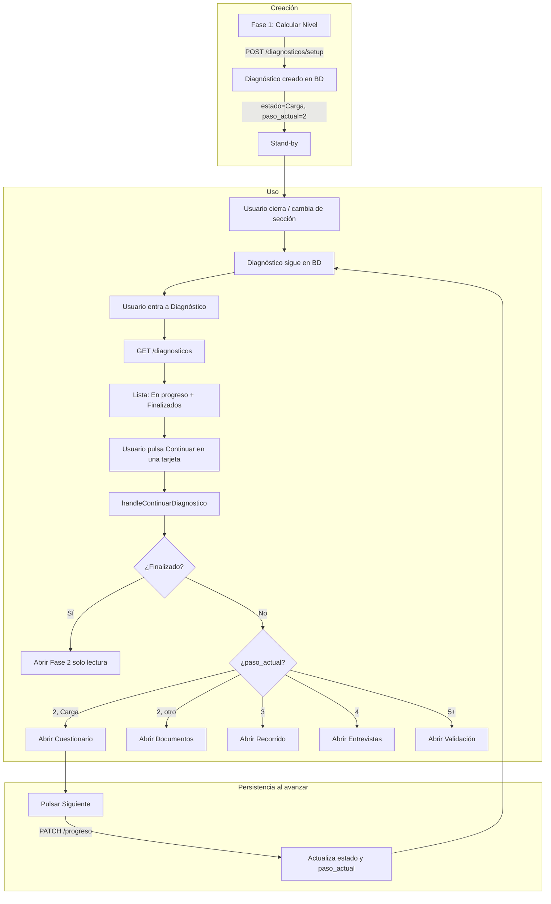

# Área de Diagnóstico — Guardado en stand-by y dónde quedan los diagnósticos

Este documento explica de forma detallada qué ocurre cuando un diagnóstico se deja “guardado para continuar después”, dónde se almacena, cómo se listan y qué acciones tiene el usuario en el área de Diagnóstico.

---

## 1. Cuándo un diagnóstico queda “en stand-by”

Un diagnóstico queda **en stand-by** (guardado para continuar luego) siempre que:

- **Se ha creado** (el usuario completó al menos la Fase 1 y pulsó “Calcular Nivel”).
- **No se ha finalizado** (no se ha pulsado “Finalizar y Generar Análisis” en Fase 6).

En ese caso:

- Los datos se guardan en la **base de datos** (tabla `diagnosticos` y tablas relacionadas).
- El usuario puede **cerrar** la vista (botón “Cerrar” o “✕”) o ir a otra sección del menú **sin perder** el diagnóstico.
- No hace falta ningún botón extra de “Guardar”: el avance se persiste al usar **“Siguiente”** en cada fase y, en Fase 1 y 2, con guardado automático o al responder/confirmar alcance.

### Dónde se persiste el “estado” del diagnóstico

| Dónde | Qué se guarda |
|-------|----------------|
| **Tabla `diagnosticos`** | `id`, `tenant_id`, `planta_id`, `area_id`, `estado`, `paso_actual`, `nivel_calculado`, `data_setup`, `created_at`, `updated_at`, y al finalizar: `analisis_final_ia`, `analisis_generado_en`, `fecha_cierre`, `puntuacion`, etc. |
| **Al crear (Fase 1)** | `POST /api/diagnosticos/setup`: se inserta una fila con `estado = 'Carga'`, `paso_actual = 2`, `nivel_calculado` y `data_setup` (dimensiones + justificaciones). |
| **Al avanzar de fase** | El front llama `PATCH /api/diagnosticos/:id/progreso` con `estado` y `paso_actual` (por ejemplo al pulsar “Siguiente: Recorrido Técnico”). Así el backend “recuerda” en qué fase quedó. |
| **Fase 2** | Respuestas por pregunta en `diagnostico_respuestas`. Si el usuario confirma alcance, se rellena `diagnostico_preguntas` (snapshot). |
| **Fases 3–6** | Documentos, notas de campo, entrevistas, validaciones HITL se guardan en sus propias tablas asociadas a `diagnostico_id`. |

Si el usuario **no** pulsa “Siguiente” en una fase y solo cierra, esa fase no actualiza `estado`/`paso_actual`; el diagnóstico sigue en el último paso que sí se guardó (por ejemplo, si avanzó de Fase 3 a Fase 4 y luego cierra en Fase 4, queda con `estado`/`paso` de Fase 4).

---

## 2. Dónde está el “área de Diagnóstico” en la aplicación

| Elemento | Descripción |
|----------|-------------|
| **Menú lateral** | Opción **“Diagnóstico”** (o “Diagnósticos PSM” según el texto del menú). |
| **Al hacer clic** | Se muestra la **página de Diagnóstico**: `PaginaDiagnosticos`, que a su vez renderiza **`DiagnosticosDashboard`**. |
| **Ruta / flujo** | No hay ruta URL independiente obligatoria: la vista depende del estado de la app (`activeNav === 'Diagnóstico'` y `currentPage.view === null`). |

En esa página:

- Se listan **todos los diagnósticos** del tenant (y opcionalmente filtrados por estado si el backend lo soporta).
- Se diferencian dos bloques: **En progreso** y **Diagnósticos finalizados** (histórico).

---

## 3. Estructura de la página de Diagnóstico

### 3.1 Header de página (PaginaDiagnosticos)

| Elemento | Tipo | Descripción |
|----------|------|-------------|
| **Título** | Texto | “Diagnósticos PSM”. |
| **Subtítulo** | Texto | “Gestiona y consulta todos los diagnósticos de seguridad de procesos”. |
| **Botón “Nuevo Diagnóstico”** | Acción | Llama a `onNuevoDiagnostico()`. En App eso hace `irAFase('wizard', null, null)`: abre la Fase 1 (Motor de Clasificación) para crear un diagnóstico desde cero. |

### 3.2 Contenido: DiagnosticosDashboard

El contenido real lo renderiza **DiagnosticosDashboard**. Ahí ocurre:

- **Carga inicial**: al montar, se llama a `apiService.fetchDiagnosticos()` → `GET /api/diagnosticos` (sin filtro de estado), que devuelve todos los diagnósticos del tenant con columnas enriquecidas (`planta_nombre`, `area_nombre`, `consultor_nombre`, etc.).
- **Separación en dos listas**:
  - **En progreso**: `diagnosticos.filter(d => !esFinalizado(d.estado))` (estado distinto de `Finalizado` y `Aprobado`).
  - **Histórico (finalizados)**: `diagnosticos.filter(d => esFinalizado(d.estado))`.

---

## 4. Bloque “En progreso”

Aquí aparecen los diagnósticos **en stand-by** y los que están en curso (no finalizados).

### 4.1 Encabezado del bloque

| Elemento | Descripción |
|----------|-------------|
| **Título** | “En progreso”. |
| **Badge** | Número de diagnósticos en progreso (ej. “3”). |
| **Botones (barra superior)** | Si no se oculta el botón: “Nuevo Diagnóstico” (igual que el del header). Solo **SuperAdmin**: “Limpiar finalizados” (elimina de la BD todos los finalizados/aprobados). Botón “Actualizar” (icono Refresh): vuelve a llamar `fetchDiagnosticos()` para refrescar la lista. |

### 4.2 Lista de tarjetas (En progreso)

Cada diagnóstico no finalizado se muestra en una **tarjeta** (`DiagnosticoCard`).

| Elemento | Descripción |
|----------|-------------|
| **Título de la tarjeta** | Planta y área si existen (ej. “Planta Norte / Área Producción”) o “Diagnóstico #&lt;id&gt;”. |
| **Fecha** | “Creado &lt;fecha&gt;” (`created_at`). |
| **Nivel** | Badge con nivel calculado (N1–N5) y etiqueta (Exploratorio, Básico, Estándar, Avanzado, Crítico). |
| **Botón eliminar (papelera)** | Solo si no está finalizado. Al pulsar: primero se muestra un bloque de confirmación (“¿Eliminar este diagnóstico?”). Al confirmar se llama `apiService.deleteDiagnostico(diag.id)` → `DELETE /api/diagnosticos/:id`. El diagnóstico se borra de la BD (solo permitido si no está Finalizado/Aprobado). Tras borrar, la tarjeta desaparece de la lista. |
| **Timeline de fases** | Barra visual de las 6 fases (Clasificación, Cuestionario, Documentos, Recorrido, Entrevistas, Validación). Las fases ya “pasadas” según `paso_actual` se marcan con check; la actual se resalta; el resto en gris. |
| **Perfil de clasificación** | Si existe `data_setup`, un botón “Ver perfil de clasificación” / “Ver perfil con justificaciones” que despliega las 6 dimensiones y sus justificaciones (solo lectura). |
| **Estado textual** | “Fase X: &lt;nombre de la fase&gt;” (ej. “Fase 3: Documentos”) o “✓ Finalizado” si por algún motivo se considera finalizado. |
| **Botón “Continuar”** | Si no está finalizado: botón verde “Continuar”. Si está finalizado: botón gris “Ver”. Al hacer clic se ejecuta `onContinuar(diag)` → en App es `handleContinuarDiagnostico(diag)`. |

### 4.3 Qué pasa al pulsar “Continuar” (lógica de reentrada)

En **App.jsx**, `handleContinuarDiagnostico(diag)` decide **a qué fase abrir** según el diagnóstico:

| Condición | Acción |
|-----------|--------|
| `estado === 'Finalizado'` o `'Aprobado'` | Se abre la vista de **Cuestionario** (Fase 2) en modo solo lectura para ese `diag.id` (para poder “Ver” el diagnóstico cerrado). |
| `paso_actual` (o paso derivado de `estado`) **≤ 1** | Se abre la **Fase 1 (Wizard)** sin diagnóstico concreto (`irAFase('wizard', null, null)`). Caso marginal (ej. diagnóstico recién creado pero con paso 1). |
| `paso_actual === 2` | Si `estado === 'Carga'` → se abre **Cuestionario** (Fase 2) para ese `diag.id`. Si no es `Carga` → se abre **Documentos** (Fase 3) para ese `diag.id`. |
| `paso_actual === 3` | Se abre **Recorrido** (Fase 4) para ese `diag.id`. |
| `paso_actual === 4` | Se abre **Entrevistas** (Fase 5) para ese `diag.id`. |
| `paso_actual === 5` o mayor | Se abre **Validación** (Fase 6) para ese `diag.id`. |

El **paso** se obtiene así: `paso = diag.paso_actual ?? estadoAPaso(diag.estado)`.  
`estadoAPaso` mapea: Configuracion→1, Carga/Borrador→2, Recorrido→3, Entrevistas→4, Validacion/'En Validación'→5, Finalizado/Aprobado→6.

Así, al pulsar **Continuar** el usuario vuelve **exactamente** a la fase donde quedó (o la siguiente lógica si el backend tiene `paso_actual` actualizado).

### 4.4 Si no hay diagnósticos en progreso

Se muestra un mensaje: “No tienes diagnósticos en progreso” y un botón **“Iniciar un nuevo diagnóstico”** que hace lo mismo que “Nuevo Diagnóstico” (abre el wizard de Fase 1).

---

## 5. Bloque “Diagnósticos finalizados” (histórico)

Aquí se listan los diagnósticos con `estado === 'Finalizado'` o `'Aprobado'`. **Ahí “quedan”** los diagnósticos ya cerrados.

### 5.1 Encabezado

| Elemento | Descripción |
|----------|-------------|
| **Título** | “Diagnósticos finalizados” y badge con el número. |
| **Texto** | “Haz clic en ‘Ver Análisis’ para desplegar el informe de IA.” |

### 5.2 Filtros (solo en histórico)

| Elemento | Descripción |
|----------|-------------|
| **Planta** | Desplegable “Todas las plantas” o una planta concreta. Opciones vienen de la jerarquía (`plantas`). |
| **Área** | Desplegable “Todas las áreas” o áreas de la planta elegida. Solo visible si hay áreas para esa planta. |
| **“Limpiar”** | Quita filtros de planta y área. |

La tabla de finalizados se filtra por `planta_id` y `area_id` según los selectores.

### 5.3 Tabla de finalizados

Cada fila es un diagnóstico finalizado (`HistoricoRow`).

| Columna | Contenido |
|---------|-----------|
| **Diagnóstico** | Planta (o “Diagnóstico #&lt;id&gt;”), área si existe. Segunda línea: “Iniciado &lt;fecha&gt;”. |
| **Fecha cierre** | `analisis_generado_en` o `fecha_cierre` (fecha de cierre o de generación del análisis). |
| **Nivel** | Badge N1–N5 (nivel calculado). |
| **Puntaje** | Porcentaje (verde/amarillo/rojo según valor). Sale de `analisis_final_ia.puntaje_global` o `puntuacion`. |
| **Consultor** | Nombre del consultor si existe. |
| **Acciones** | **“Ver Análisis”**: expande la fila y carga el análisis IA (`GET /api/diagnosticos/:id/analisis`) si aún no está en estado; muestra el panel de análisis (resumen, hallazgos, brechas, fortalezas, plan de acción, conclusión) y opciones “Regenerar” y “Descargar Word”. **“Word”**: descarga el reporte Word del diagnóstico (`GET /api/diagnosticos/:id/reporte`). |

Al expandir “Ver Análisis” también se muestra, si existe, el **perfil de clasificación** (dimensiones Fase 1).

### 5.4 Botón “Limpiar finalizados” (SuperAdmin)

Solo visible para rol **SuperAdmin** (y según implementación, posiblemente AdminInquilino):

- Llama a `previewLimpiarDiagnosticosFinalizados` y luego, tras confirmación, a `limpiarDiagnosticosFinalizados`.
- Elimina **de la base de datos** todos los diagnósticos en estado Finalizado o Aprobado y sus datos asociados (plan de acción, documentos, entrevistas, recorrido, respuestas, validaciones HITL, snapshot de preguntas).
- Tras el borrado, la lista se refresca y el bloque “Diagnósticos finalizados” puede quedar vacío.

---

## 6. Resumen: dónde “quedan” los diagnósticos

| Situación | Dónde quedan | Cómo se ven en la app |
|-----------|--------------|------------------------|
| **Creado en Fase 1, usuario cierra sin pulsar Siguiente** | En BD con `estado = 'Carga'`, `paso_actual = 2`. | En “En progreso”. Al pulsar “Continuar” se abre Fase 2 (Cuestionario). |
| **Usuario avanza hasta Fase 3 y cierra** | En BD con `estado` y `paso_actual` actualizados al último “Siguiente” (ej. Recorrido / paso 3). | En “En progreso”. “Continuar” abre la fase correspondiente (ej. Recorrido). |
| **Usuario finaliza en Fase 6** | En BD con `estado = 'Finalizado'`, análisis y reporte disponibles. | Pasa a “Diagnósticos finalizados”. Ahí puede “Ver Análisis” y “Word”. |
| **Usuario elimina (solo en progreso)** | Se borra de la BD con `DELETE /api/diagnosticos/:id`. | Desaparece de “En progreso”. |

---

## 7. Diagrama: de “stand-by” a “continuar”

---

## 8. Referencia de APIs implicadas

| Acción | Método y ruta |
|--------|-------------------------------|
| Listar diagnósticos | `GET /api/diagnosticos` (opcional `?estado=`) |
| Crear diagnóstico (Fase 1) | `POST /api/diagnosticos/setup` |
| Actualizar progreso (estado/paso) | `PATCH /api/diagnosticos/:id/progreso` |
| Eliminar diagnóstico (solo no finalizado) | `DELETE /api/diagnosticos/:id` |
| Obtener análisis IA (finalizado) | `GET /api/diagnosticos/:id/analisis` |
| Descargar reporte Word | `GET /api/diagnosticos/:id/reporte` |
| Limpiar finalizados (SuperAdmin) | `POST /api/admin/limpiar-diagnosticos-finalizados` |

---

## 9. Componentes implicados

| Componente | Rol |
|------------|-----|
| **App.jsx** | Define `activeNav`, `currentPage`; renderiza `PaginaDiagnosticos` cuando `activeNav === 'Diagnóstico'`; implementa `handleContinuarDiagnostico` y `irAFase`. |
| **PaginaDiagnosticos.jsx** | Contenedor de la página: header “Diagnósticos PSM” y botón “Nuevo Diagnóstico”; renderiza `DiagnosticosDashboard` con `onContinuar` y `onNuevoDiagnostico`. |
| **DiagnosticosDashboard.jsx** | Carga `fetchDiagnosticos()`, separa en progreso / finalizados, renderiza tarjetas (`DiagnosticoCard`), tabla de histórico (`HistoricoRow`), filtros, botones Limpiar finalizados y Actualizar. |

Con esto queda documentado de forma detallada todo lo que pasa en el área de Diagnóstico cuando un diagnóstico queda guardado en stand-by y dónde quedan los diagnósticos (en progreso vs finalizados).
