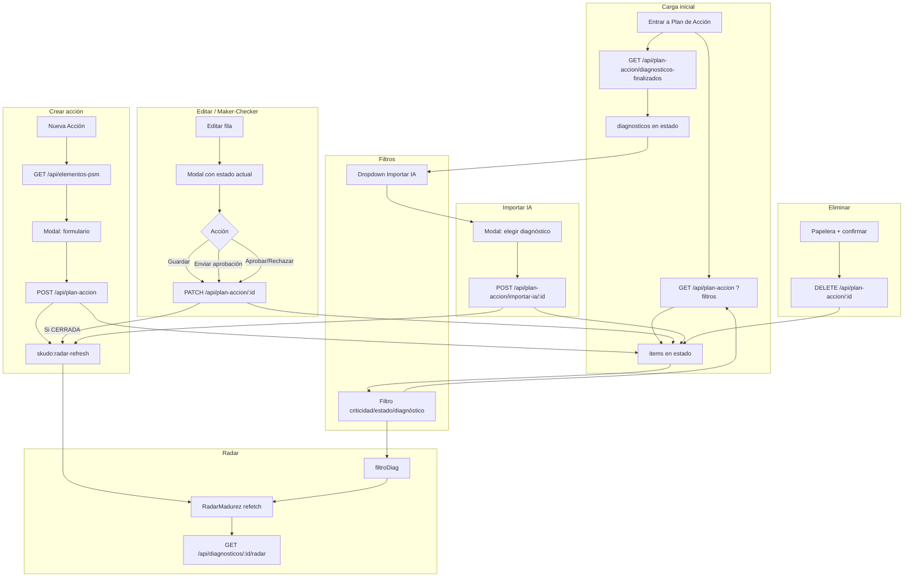

# Área de Plan de Acción — Documentación funcional completa

Este documento describe de forma detallada todo lo que ocurre en la sección **Plan de Acción**: de dónde viene la información, qué pasa funcionalmente, cómo se modifican las acciones y qué efectos tienen el cierre o la actualización de planes y acciones.

---

## 1. Ubicación y propósito del área

| Elemento | Descripción |
|----------|-------------|
| **Menú** | Opción **"Plan de Acción"** en el menú lateral (vista Consultor). |
| **Componente** | `PlanDeAccion.jsx` (export default). Se renderiza cuando `activeNav === 'Plan de Acción'` y no hay vista de diagnóstico activa. |
| **Propósito** | Gestionar las **acciones correctivas** derivadas de los diagnósticos PSM: crear, editar, eliminar, filtrar y seguir el flujo de aprobación Maker-Checker. Las acciones se asocian a un **Elemento PSM** (catálogo de 20 elementos) y opcionalmente a un **diagnóstico origen**. |

---

## 2. De dónde viene la información

### 2.1 Datos cargados al entrar al área

Al montar el componente **PlanDeAccion** se ejecuta `cargar()`, que hace **dos peticiones en paralelo**:

| Origen | API | Descripción |
|--------|-----|-------------|
| **Lista de acciones** | `GET /api/plan-accion` (con query opcionales) | Devuelve todos los ítems del Plan de Acción del tenant. El backend hace `SELECT` sobre `plan_accion_items` con JOINs a `usuarios`, `diagnosticos`, `plantas`, `elementos_psm_ccps`. Incluye: `id`, `nombre`, `descripcion`, `responsable`, `responsable_email`, `fecha_limite`, `criticidad`, `estado`, `estado_aprobacion`, `elemento_psm_id`, `elemento_psm`/`elemento_psm_nombre`, `diagnostico_id`, `planta_nombre`, `notificaciones_activas`, `origen_ia`, `plazo_ia`, `justificacion_operativo`, `evidencia_texto`, `comentario_aprobador`, etc. |
| **Diagnósticos finalizados** | `GET /api/plan-accion/diagnosticos-finalizados` | Lista de diagnósticos con `estado IN ('Finalizado','Aprobado')` y `analisis_final_ia IS NOT NULL`, para poder **importar** el plan generado por la IA. Incluye `id`, `planta_nombre`, `area_nombre`, `analisis_final_ia`, etc. |

Los **filtros** (criticidad, estado, diagnóstico) se envían como query params a `GET /api/plan-accion`; al cambiar cualquier filtro, `cargar()` se vuelve a ejecutar (está en las dependencias del `useCallback`).

### 2.2 Catálogo de elementos PSM

El **dropdown "Elemento PSM"** del modal de crear/editar acción se alimenta de:

| Origen | API | Descripción |
|--------|-----|-------------|
| **Elementos PSM** | `GET /api/elementos-psm` | Lista de la tabla `elementos_psm_ccps` (id, nombre). Son los 20 elementos oficiales PSM (ej. Cultura de Seguridad, Integridad Mecánica, Auditorías, etc.). Se cargan al abrir el modal. |

### 2.3 Persistencia: tabla `plan_accion_items`

Toda la información del Plan de Acción se guarda en la tabla **`plan_accion_items`**:

| Columna | Tipo / notas |
|---------|----------------|
| `id` | Serial PK |
| `tenant_id` | Para multi-tenant |
| `diagnostico_id` | FK a diagnosticos (puede ser NULL si la acción es manual sin diagnóstico) |
| `nombre`, `descripcion` | Texto de la acción |
| `responsable`, `responsable_email` | Persona asignada y correo |
| `fecha_limite` | Fecha límite (DATE) |
| `criticidad` | 'Crítico' \| 'Alto' \| 'Medio' \| 'Bajo' |
| `estado` | 'Pendiente' \| 'En Progreso' \| 'Completado' \| 'Cancelado' |
| `notificaciones_activas` | Boolean: recordatorios por email 10, 5, 3 y 2 días antes del vencimiento |
| `origen_ia` | Boolean: si la acción vino del análisis IA del diagnóstico |
| `plazo_ia` | Texto opcional (ej. "30 días") cuando viene de IA |
| `elemento_psm`, `elemento_psm_id` | Nombre e ID del elemento PSM (obligatorio; FK a elementos_psm_ccps) |
| `creado_por` | FK a usuarios |
| `estado_aprobacion` | 'PENDIENTE' \| 'EN_REVISION' \| 'CERRADA' \| 'RECHAZADA' (Maker-Checker) |
| `justificacion_operativo`, `evidencia_texto`, `comentario_aprobador` | Campos del flujo Maker-Checker |
| `completada`, `impacto_puntaje` | Legacy / impacto en radar |
| `created_at`, `updated_at` | Timestamps |

Las **notificaciones** enviadas se registran en `plan_accion_notif_log` (item_id, dias_restantes, enviado_a, enviado_en) para no reenviar el mismo recordatorio.

---

## 3. Estructura de la pantalla Plan de Acción

### 3.1 Header (sticky)

| Elemento | Descripción |
|----------|-------------|
| **Título** | "Plan de Acción". |
| **Subtítulo** | "Acciones correctivas derivadas de los diagnósticos PSM". |
| **Botón Actualizar** | Icono Refresh: vuelve a llamar `cargar()` (refresca acciones y diagnósticos finalizados). |
| **Botón "Enviar Notificaciones"** | Ejecuta el ciclo de notificaciones por email (10, 5, 3, 2 días antes del vencimiento) para las acciones que cumplan criterios. Llama `POST /api/plan-accion/notificaciones/enviar`. Útil para pruebas. |
| **Botón "Importar desde IA"** | Abre el modal **ModalImportarIA**: permite elegir un diagnóstico finalizado e importar su `analisis_final_ia.plan_accion` como nuevas filas en `plan_accion_items`. Solo visible si el usuario **no** es `ejecutivo_lectura`. Deshabilitado si no hay diagnósticos finalizados. |
| **Botón "Nueva Acción"** | Abre el modal de crear/editar con `item = null` (modo creación). Oculto para `ejecutivo_lectura`. |

### 3.2 Panel de métricas (tarjetas)

Cinco tarjetas con totales calculados en el front a partir de `items`:

| Tarjeta | Cálculo |
|---------|---------|
| **Total** | `items.length` |
| **Pendientes** | Acciones con `estado === 'Pendiente'` |
| **En Progreso** | `estado === 'En Progreso'` |
| **Completadas** | `estado === 'Completado'` |
| **Críticas** | `criticidad === 'Crítico'` y estado distinto de Completado/Cancelado |

### 3.3 Filtros

Una fila con desplegables y texto:

| Filtro | Opciones | Efecto |
|--------|----------|--------|
| **Criticidad** | Todas, Crítico, Alto, Medio, Bajo | Se envía `criticidad` en `GET /api/plan-accion`; la lista se recarga. |
| **Estado** | Todos, Pendiente, En Progreso, Completado, Cancelado | Se envía `estado` en la misma petición. |
| **Diagnóstico** | Todos los diagnósticos + lista de diagnósticos finalizados (por id y planta_nombre) | Se envía `diagnostico_id`; la lista muestra solo acciones de ese diagnóstico. |
| **Limpiar** | Enlace "Limpiar" | Borra los tres filtros y recarga. |
| **Contador** | "N acciones" | Muestra `items.length` tras filtrar. |

### 3.4 Radar de madurez (condicional)

Si hay **diagnóstico seleccionado** en el filtro (`filtroDiag` no vacío), debajo de los filtros se muestra el componente **RadarMadurez** con `diagnosticoId={filtroDiag}`. El radar obtiene datos de `GET /api/diagnosticos/:id/radar` y refleja la madurez por elemento PSM; las acciones con `estado_aprobacion === 'CERRADA'` suman al puntaje del radar. Al cambiar el filtro de diagnóstico, el radar se actualiza (key = filtroDiag).

### 3.5 Tabla principal de acciones

Si **no hay acciones** (tras filtrar): mensaje "No hay acciones registradas", texto explicativo y botones "Importar desde IA" y "Nueva Acción" (según rol).

Si **hay acciones**: tabla con columnas:

| Columna | Contenido |
|---------|-----------|
| **Acción Correctiva** | Nombre de la acción; badge "IA" si `origen_ia`; elemento PSM debajo; planta si existe. Botón para expandir/colapsar y ver la descripción en una fila extra. |
| **Responsable** | Nombre, email (truncado), icono de notificaciones (activas/inactivas). |
| **Fecha Límite** | Fecha formateada; si está vencida y no está Completado/Cancelado, se muestra "VENCIDO" y la fila con fondo rojo suave. Si no hay fecha pero hay `plazo_ia`, se muestra ese texto. |
| **Criticidad** | Badge con color (Crítico=rojo, Alto=naranja, Medio=amarillo, Bajo=verde). |
| **Aprobación** | Badge del estado Maker-Checker (Pendiente, En Revisión, Cerrada, Rechazada). Según estado y rol: botón "Solicitar Revisión" (PENDIENTE/RECHAZADA) o botones "Aprobar" / "Rechazar" (EN_REVISION). |
| **Editar** | Botón lápiz (abre modal de edición) y botón papelera (confirmación y luego eliminación). |

Cada fila es el componente **FilaAccion**; al expandir se muestra la descripción en una fila adicional.

---

## 4. Modal Crear / Editar Acción (ModalAccion)

Se abre al pulsar "Nueva Acción" (item = null) o al pulsar Editar en una fila (item = objeto de la acción).

### 4.1 Campos del formulario

| Campo | Obligatorio | Descripción | Restricciones por rol / estado |
|-------|-------------|-------------|--------------------------------|
| **Nombre** | Sí | Nombre de la acción. | Solo lectura si `ejecutivo_lectura` o estado CERRADA o EN_REVISION (readonly general). |
| **Descripción** | No | Detalle de la acción. | Mismo readonly. |
| **Responsable** | No | Nombre del responsable. | Mismo readonly. |
| **Correo electrónico** | No | Email para notificaciones. | Mismo readonly. |
| **Fecha Límite** | No | Fecha de vencimiento. | Mismo readonly. |
| **Nivel de Criticidad** | No | Crítico, Alto, Medio, Bajo (default Medio). | Mismo readonly. |
| **Estado** | No | Pendiente, En Progreso, Completado, Cancelado. | Mismo readonly. |
| **Elemento PSM** | Sí | Desplegable con elementos de `GET /api/elementos-psm`. | Obligatorio al guardar; mismo readonly. |
| **Diagnóstico Origen** | No | Desplegable con diagnósticos finalizados (planta/área). | Mismo readonly. |

Al **editar**, el Elemento PSM y el Diagnóstico Origen se inicializan con los valores actuales de la acción (`elemento_psm_id`, `diagnostico_id`).

### 4.2 Sección Maker-Checker (solo al editar)

Visible solo cuando **no** es acción nueva. Incluye:

| Campo | Cuándo editable | Descripción |
|-------|-----------------|-------------|
| **Justificación del operativo** | Solo si estado aprobación es PENDIENTE o RECHAZADA y el usuario no es ejecutivo_lectura. | Texto que explica qué se hizo para cumplir la acción. |
| **Evidencia (enlace o detalle)** | Mismo criterio. | URL o descripción de la evidencia. |
| **Comentario del aprobador / verificador** | Editable solo si estado es EN_REVISION y el usuario tiene rol que puede aprobar/rechazar. | Retroalimentación del verificador. |

Lógica de **solo lectura**:

- **ejecutivo_lectura**: todo el modal en solo lectura; solo se muestra botón "Cerrar".
- **Estado CERRADA**: todos los campos en solo lectura; solo "Cerrar".
- **Estado EN_REVISION**: justificación y evidencia en solo lectura; comentario del aprobador editable solo para roles que pueden aprobar/rechazar.

### 4.3 Panel de notificaciones por email

Toggle **"Notificaciones por Email"**: activa/desactiva recordatorios automáticos al responsable (10, 5, 3 y 2 días antes de la fecha límite). Si está activo pero falta email o fecha límite, se muestra aviso. Solo editable si no es solo lectura.

### 4.4 Botones del pie del modal

| Estado de la acción / Rol | Botones mostrados |
|---------------------------|-------------------|
| **ejecutivo_lectura** o **CERRADA** | Solo "Cerrar". |
| **Nueva acción** (crear) | Cancelar, "Crear Acción". |
| **PENDIENTE o RECHAZADA** (editar) | Cancelar, "Guardar cambios", "Enviar para aprobación". |
| **EN_REVISION** (editar, usuario con permiso de aprobar) | Cancelar, "Rechazar", "Aprobar". |

- **Guardar cambios**: `handleGuardar({})` — envía todos los campos del formulario sin cambiar `estado_aprobacion`.
- **Enviar para aprobación**: `handleGuardar({ estado_aprobacion: 'EN_REVISION', justificacion_operativo, evidencia_texto })`.
- **Rechazar**: `handleGuardar({ estado_aprobacion: 'RECHAZADA', comentario_aprobador })`.
- **Aprobar**: `handleGuardar({ estado_aprobacion: 'CERRADA', comentario_aprobador })`; además se dispara el evento `skudo:radar-refresh` para actualizar el radar.

---

## 5. Cómo se modifican las acciones (backend y flujo)

### 5.1 Crear acción (manual)

| Paso | Acción |
|------|--------|
| 1 | Usuario rellena el formulario (nombre obligatorio, elemento PSM obligatorio) y pulsa "Crear Acción". |
| 2 | Front llama `apiService.createPlanAccionItem(form)` → `POST /api/plan-accion` con body: nombre, descripcion, responsable, responsable_email, fecha_limite, criticidad, estado, diagnostico_id, elemento_psm_id, notificaciones_activas, etc. |
| 3 | Backend valida nombre y que `elemento_psm_id` esté entre 1 y 20. Inserta en `plan_accion_items` con `estado_aprobacion = 'PENDIENTE'` (default), `creado_por = req.usuario.id`. |
| 4 | Front añade el ítem devuelto al estado local y dispara `skudo:radar-refresh`. Cierra el modal. |

### 5.2 Editar acción (guardar, enviar, aprobar, rechazar)

| Paso | Acción |
|------|--------|
| 1 | Usuario modifica campos y pulsa "Guardar cambios", "Enviar para aprobación", "Aprobar" o "Rechazar". |
| 2 | Front llama `apiService.updatePlanAccionItem(editando.id, payload)` → `PATCH /api/plan-accion/:id`. El payload puede incluir estado_aprobacion, justificacion_operativo, evidencia_texto, comentario_aprobador y el resto de campos. |
| 3 | Backend: si `estado_aprobacion === 'CERRADA'`, comprueba que el rol **no** sea `operativo_n1` ni `ejecutivo_lectura` y que esté en `ROLES_QUE_PUEDEN_APROBAR`. Actualiza todas las columnas enviadas; si se desactivan notificaciones, borra entradas en `plan_accion_notif_log` para ese ítem. |
| 4 | Front actualiza el ítem en el estado local; si se aprobó (CERRADA), dispara `skudo:radar-refresh`. Cierra el modal. |

### 5.3 Cambiar estado de aprobación desde la tabla (sin abrir modal)

En **FilaAccion** hay botones directos:

- **Solicitar Revisión** (estado PENDIENTE o RECHAZADA): llama `onCambiarEstadoAprobacion(item.id, 'EN_REVISION')` → en el padre es `handleCambiarEstadoAprobacion`, que hace `PATCH /api/plan-accion/:id` solo con `estado_aprobacion: 'EN_REVISION'` (y el resto del item actual). No envía justificación/evidencia desde la tabla (eso se hace en el modal).
- **Aprobar** (estado EN_REVISION): mismo flujo con `estado_aprobacion: 'CERRADA'`; se dispara `skudo:radar-refresh`.
- **Rechazar** (estado EN_REVISION): con `estado_aprobacion: 'RECHAZADA'`.

Estos botones solo se muestran según el rol (operativo puede "Solicitar Revisión"; aprobar/rechazar solo los roles en `ROLES_QUE_PUEDEN_APROBAR`; ejecutivo_lectura no ve botones de cambio de estado).

### 5.4 Eliminar acción

| Paso | Acción |
|------|--------|
| 1 | Usuario pulsa la papelera en la fila; aparece confirmación (Cancelar / Eliminar). |
| 2 | Al confirmar, front llama `apiService.deletePlanAccionItem(id)` → `DELETE /api/plan-accion/:id`. |
| 3 | Backend ejecuta `DELETE FROM plan_accion_items WHERE id = $1`. |
| 4 | Front quita el ítem del estado local (`setItems(prev => prev.filter(i => i.id !== id))`). No se dispara radar explícitamente aquí (el radar por diagnóstico se recalcula al cargar de nuevo). |

---

## 6. Importar plan desde IA

### 6.1 Origen de los datos

El plan importado sale del **análisis final del diagnóstico** ya guardado en BD: campo `diagnosticos.analisis_final_ia` (JSON), propiedad `plan_accion` (array de objetos con `accion`, `plazo`, `prioridad`, `responsable`, etc.).

### 6.2 Flujo funcional

| Paso | Acción |
|------|--------|
| 1 | Usuario pulsa "Importar desde IA"; se abre **ModalImportarIA** con un desplegable de diagnósticos finalizados (id, planta/área, puntaje si existe). |
| 2 | Al elegir un diagnóstico, se muestra una vista previa de las acciones que tiene ese diagnóstico en `analisis_final_ia.plan_accion`. |
| 3 | Usuario pulsa "Importar N Acciones". Front llama `apiService.importarPlanIA(diagnosticoId)` → `POST /api/plan-accion/importar-ia/:diagId`. |
| 4 | Backend: lee `analisis_final_ia.plan_accion` del diagnóstico; para cada ítem resuelve el elemento PSM (por nombre o por similitud) con el catálogo `elementos_psm_ccps`; crea una fila en `plan_accion_items` con `diagnostico_id`, `origen_ia = true`, `plazo_ia`, `estado = 'Pendiente'`, `estado_aprobacion = 'PENDIENTE'`. Mapeo de plazo a criticidad: Inmediato→Crítico, 30 días→Alto, 90 días→Medio, 6 meses→Bajo. |
| 5 | Front llama `cargar()` de nuevo y dispara `skudo:radar-refresh`. Cierra el modal. |

Si el diagnóstico no tiene `plan_accion` en el análisis IA, el backend responde error y el botón Importar se deshabilita en el modal cuando la lista previa está vacía.

---

## 7. Qué modifica una vez se cierran o actualizan acciones

### 7.1 Al guardar (crear o actualizar)

- **Base de datos**: la fila en `plan_accion_items` se inserta o actualiza (nombre, descripción, fechas, estado, estado_aprobacion, justificación, evidencia, comentario aprobador, elemento_psm_id, etc.).
- **Lista en pantalla**: el estado React se actualiza (se sustituye o se añade el ítem devuelto por la API).
- **Radar de madurez**: solo las acciones con `estado_aprobacion === 'CERRADA'` contribuyen al cálculo del radar (`GET /api/diagnosticos/:id/radar`). Por tanto, al **aprobar** (pasar a CERRADA) el puntaje del elemento PSM correspondiente puede subir; al rechazar o quitar el cierre, ese impacto deja de contarse. Tras aprobar, el front dispara `skudo:radar-refresh` para que el componente RadarMadurez (si está montado con ese diagnóstico) recargue datos.

### 7.2 Al eliminar una acción

- La fila desaparece de `plan_accion_items`.
- La lista en la UI se actualiza (se quita el ítem del estado).
- Si esa acción estaba CERRADA y asociada a un diagnóstico, el radar de ese diagnóstico ya no contará esa acción; el siguiente fetch del radar reflejará el cambio.

### 7.3 Notificaciones por email

- Si **notificaciones_activas** está en true y hay `responsable_email` y `fecha_limite`, el job/cron (o la llamada manual a "Enviar Notificaciones") envía correos a 10, 5, 3 y 2 días antes del vencimiento, registrando en `plan_accion_notif_log` para no duplicar.
- Si el usuario **desactiva** notificaciones en el modal, el backend borra los registros de log de ese ítem para que, si se vuelven a activar, se puedan reenviar recordatorios.

---

## 8. Roles y permisos (Maker-Checker)

| Rol | Ver lista / detalle | Crear / Editar campos | Enviar para aprobación | Aprobar / Rechazar |
|-----|--------------------|------------------------|-------------------------|---------------------|
| **ejecutivo_lectura** | Sí | No (todo solo lectura) | No | No |
| **operativo_n1** | Sí | Sí (salvo en EN_REVISION/CERRADA justif/evidencia) | Sí | No (el backend rechaza PATCH con CERRADA) |
| **verificador_n2**, **consultor_skudo**, **admin_cliente**, **SuperAdmin**, **AdminInquilino**, **Consultor** | Sí | Sí (según estado) | Sí | Sí |

El backend valida en `PATCH /api/plan-accion/:id`: si el cuerpo incluye `estado_aprobacion: 'CERRADA'`, comprueba que el rol no sea `operativo_n1` ni `ejecutivo_lectura` y que esté en la lista de roles que pueden aprobar.

---

## 9. Diagrama: flujo de datos y acciones

---

## 10. Referencia de APIs del Plan de Acción

| Acción | Método y ruta |
|--------|-------------------------------|
| Listar acciones (con filtros) | `GET /api/plan-accion?criticidad=&estado=&diagnostico_id=` |
| Listar elementos PSM | `GET /api/elementos-psm` |
| Diagnósticos para importar | `GET /api/plan-accion/diagnosticos-finalizados` |
| Crear acción | `POST /api/plan-accion` |
| Actualizar acción (incl. Maker-Checker) | `PATCH /api/plan-accion/:id` |
| Eliminar acción | `DELETE /api/plan-accion/:id` |
| Importar plan desde IA | `POST /api/plan-accion/importar-ia/:diagId` |
| Enviar notificaciones (ciclo) | `POST /api/plan-accion/notificaciones/enviar` |
| Radar del diagnóstico | `GET /api/diagnosticos/:id/radar` |

---

## 11. Resumen: qué pasa al cerrar o actualizar

| Acción del usuario | Efecto en BD | Efecto en UI | Efecto en Radar |
|--------------------|--------------|--------------|------------------|
| **Crear acción** | INSERT en plan_accion_items (PENDIENTE) | Nueva fila en tabla | Si hay filtro por diagnóstico, al refetch del radar se considerará; solo suma cuando pase a CERRADA. |
| **Guardar cambios** (sin cambiar aprobación) | UPDATE campos | Fila actualizada | Sin cambio directo (el radar usa estado_aprobacion). |
| **Enviar para aprobación** | estado_aprobacion → EN_REVISION, guarda justif/evidencia | Badge "En Revisión" | Sigue sin sumar hasta CERRADA. |
| **Aprobar** | estado_aprobacion → CERRADA, comentario_aprobador | Badge "Cerrada" | Suma al puntaje del elemento PSM en el radar del diagnóstico; se dispara refetch. |
| **Rechazar** | estado_aprobacion → RECHAZADA | Badge "Rechazada" | No suma en radar. |
| **Eliminar** | DELETE fila | Fila desaparece | Deja de contar en el radar para ese diagnóstico. |
| **Importar desde IA** | N INSERTs (origen_ia=true, PENDIENTE) | N nuevas filas | Tras cargar, si se filtra por ese diagnóstico, el radar puede incluir las nuevas cuando se cierren. |

Con esto queda documentado de forma detallada el área de Plan de Acción: orígenes de datos, comportamiento de la interfaz, modificaciones y efectos al cerrar o actualizar acciones y planes.
