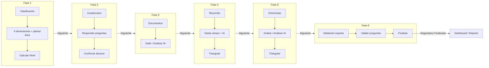
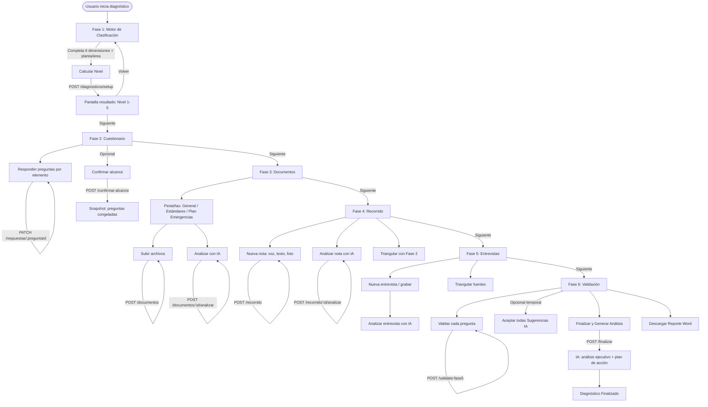
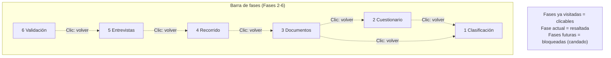

# Proceso de Diagnóstico PSM — Descripción funcional fase a fase

Este documento describe de forma detallada cada fase del diagnóstico: pantallas, acciones, tareas y botones que el usuario encuentra en cada paso.

---

## Diagrama de flujo general del proceso



---

## Diagrama detallado: decisiones y acciones clave



---

## Navegación común a todas las fases (excepto Fase 1)

En las **Fases 2 a 6** aparece la barra **Navegación entre fases** (`NavegacionFases`):

| Elemento | Descripción |
|----------|-------------|
| **Píldoras 1–6** | Clases: Clasificación, Cuestionario, Documentos, Recorrido, Entrevistas, Validación. La fase actual se resalta; las ya visitadas son clicables para volver; las futuras están bloqueadas (candado). |
| **Clic en una fase pasada** | Navega a esa fase (ej. desde Fase 5 a Fase 2). |
| **Barra de progreso “Preguntas con evidencia”** | Solo en Fases 3–6: muestra cuántas preguntas del alcance tienen ya evidencia (documentos, entrevistas, recorrido) y cuántas están validadas (Fase 6). |

Además, en todas las fases suele haber un botón **Cerrar** o **✕** que devuelve al listado de diagnósticos (Dashboard) sin cambiar el estado del diagnóstico.

---

## Fase 1 — Clasificación (Motor PSM)

**Componente:** `DiagnosticoWizard.jsx`  
**Objetivo:** Definir el perfil de riesgo en 6 dimensiones, ubicación (planta/área) y obtener el **nivel calculado** (1–5) que determina la profundidad del diagnóstico y el número de preguntas en Fase 2.

### Pantalla inicial: formulario de dimensiones

| Elemento | Tipo | Descripción |
|----------|------|-------------|
| **Título** | Texto | "Motor de Clasificación PSM" y subtítulo según paso (formulario o resultado). |
| **Botón ✕** | Acción | Cierra el wizard y vuelve al Dashboard (no crea diagnóstico si no se ha calculado). |
| **Bloque Planta / Área** | Controles | Visible solo si existen plantas en la jerarquía. **Planta / Sede**: desplegable obligatorio. **Área**: desplegable obligatorio si la planta tiene áreas. Mensaje: "Empresa y sede son obligatorios." |
| **Barra de progreso** | Visual | Muestra cuántas de las 6 dimensiones tienen un valor seleccionado (X / 6). |
| **Texto “X justificaciones documentadas”** | Visual | Cuenta de dimensiones con comentario/justificación rellenado. |
| **Nota informativa** | Texto | Explica que al seleccionar cada nivel se abre un campo para documentar la razón y que la IA usará estas notas en fases posteriores. |
| **6 tarjetas de dimensión** | Controles | Una por dimensión: Riesgo Técnico, Regulación, Madurez del SGS, Estrategia, Complejidad Operacional, Exposición Financiera. En cada una: |
| → **Descripción** | Texto | Breve descripción de la dimensión. |
| → **4 botones de valor** | Acción | Bajo, Medio, Alto, Crítico. Al elegir uno se marca y se habilita la justificación. |
| → **“Añadir justificación técnica (recomendado)”** | Botón | Abre/cierra un área de texto para comentario. El contenido se guarda en borrador (localStorage y, si hay draftId, PATCH al backend). |
| **Mensaje de error** | Texto | Si falta dimensión, planta o área al intentar calcular, se muestra debajo del contenido. |
| **Botón “Cancelar”** | Acción | Igual que ✕: sale del wizard. |
| **Botón “Calcular Nivel”** | Acción | Habilitado solo cuando las 6 dimensiones tienen valor y (si aplica) planta y área están seleccionados. Llama a `POST /api/diagnosticos/setup` con dimensiones, comentarios, planta_id, area_id. Al responder, pasa a la pantalla de resultado. |

### Pantalla de resultado (tras Calcular Nivel)

| Elemento | Tipo | Descripción |
|----------|------|-------------|
| **Badge nivel** | Visual | "Nivel X — [Exploratorio|Básico|Estándar|Avanzado|Crítico]". |
| **Número grande** | Visual | El nivel (1–5). |
| **Texto “Profundidad del Diagnóstico PSM”** | Texto | Subtítulo. |
| **Tarjeta descriptiva** | Texto | Descripción del nivel (alcance del diagnóstico según ese nivel). |
| **Perfil de riesgo evaluado** | Lista | Las 6 dimensiones con el valor elegido (Bajo/Medio/Alto/Crítico) y, si existe, la justificación en cursiva. |
| **Botón “Volver”** | Acción | Vuelve al formulario de dimensiones (pierde el resultado en pantalla pero el diagnóstico ya está creado en backend). |
| **Botón “Siguiente: Carga de Evidencia (Fase 2)”** | Acción | Navega a la Fase 2 (Cuestionario) con el `diagnostico_id` y el `nivel_calculado` devueltos por el setup. |

---

## Fase 2 — Cuestionario normativo

**Componente:** `DiagnosticoView.jsx`  
**Objetivo:** Responder las preguntas del cuestionario filtradas por nivel (complejidad ≤ nivel_calculado), agrupadas por elemento PSM. Opcionalmente **confirmar el alcance** para congelar el conjunto de preguntas (snapshot) usadas en fases posteriores.

### Header y controles globales

| Elemento | Tipo | Descripción |
|----------|------|-------------|
| **Navegación entre fases** | Barra | Ver sección común. Fase 2 activa. |
| **Título** | Texto | "Cuestionario Normativo — Fase 2". Si el diagnóstico está Finalizado/Aprobado o el usuario es Lector: badge "Solo lectura". |
| **Texto de nivel y preguntas** | Texto | "Nivel N detectado · X preguntas activadas (Y respondidas)". |
| **Botón ✕** | Acción | Cierra y vuelve al Dashboard. |
| **Barra de progreso** | Visual | Porcentaje de preguntas respondidas (barra + %). |
| **Leyenda de complejidad** | Visual | C1, C2, … según nivel (preguntas según perfil de riesgo). |
| **“Confirmar alcance (congelar preguntas)”** | Botón | Visible si el alcance **no** está confirmado. Llama a `POST /api/diagnosticos/:id/confirmar-alcance`. Rellena la tabla `diagnostico_preguntas` con las preguntas actuales del cuestionario; a partir de ahí Fases 3–6 usan solo ese conjunto. Tras confirmar, el botón se sustituye por el texto "Alcance confirmado (X preguntas congeladas)". |
| **Reintentar** | Enlace | Si hay error de carga, permite volver a cargar. |

### Cuerpo: grupos de preguntas

Las preguntas se muestran en **grupos por categoría/elemento**. Cada grupo es un acordeón.

| Elemento | Tipo | Descripción |
|----------|------|-------------|
| **Cabecera del grupo** | Botón + texto | Nombre del elemento, contador "respondidas/total", icono completado/pendiente. Clic abre/cierra el bloque de preguntas. |
| **Por cada pregunta** | Bloque | |
| → **Estado** | Icono | Check verde si tiene respuesta; círculo gris si no. |
| → **Complejidad** | Badge | C1, C2, … (según nivel). |
| → **Legislación** | Badge | Si la pregunta tiene campo legislación, se muestra abreviado. |
| → **Texto de la pregunta** | Texto | Pregunta normativa. |
| → **Botón (i)** | Acción | Abre/cierra la "guía del auditor" (guía Suficiente/Escasa/Al menos/Sin evidencia) si existe. |
| → **Opciones de respuesta** | Botones | Solo si no es solo lectura: **Suficiente**, **Escasa**, **Al menos**, **Sin evidencia**, **No aplica**. Al hacer clic se envía `PATCH .../diagnosticos/:id/respuestas/:preguntaId` con `{ respuesta }` y se actualiza el estado local. |
| → **Respuesta actual (solo lectura)** | Badge | Si el diagnóstico está finalizado o es Lector, solo se muestra la respuesta guardada. |

### Footer

| Elemento | Tipo | Descripción |
|----------|------|-------------|
| **Texto “Guardando…”** | Visual | Se muestra mientras se guarda una respuesta. |
| **Botón “Cerrar”** | Acción | Vuelve al Dashboard. |
| **Botón “Siguiente: Gestión Documental (Fase 2b)”** | Acción | Visible si no es solo lectura. Navega a la Fase 3 (Documentos/Evidencias) con el mismo `diagnosticoId`. |

---

## Fase 3 — Documentos (Gestión documental / Evidencia)

**Componente:** `EvidenciaView.jsx`  
**Objetivo:** Subir documentos por categoría PSM, extraer texto, analizarlos con IA y revisar calificaciones/brechas. Los documentos analizados alimentan la triangulación en Fase 6.

### Header

| Elemento | Tipo | Descripción |
|----------|------|-------------|
| **Navegación entre fases** | Barra | Fase 3 activa. Incluye barra de progreso de preguntas con evidencia. |
| **Título** | Texto | Referencia a Gestión Documental / Evidencia. |
| **Botón Cerrar** | Acción | Vuelve al Dashboard. |

### Pestañas de categoría

| Elemento | Tipo | Descripción |
|----------|------|-------------|
| **General** | Pestaña | Documentación general (licencias, registros, contexto). |
| **Estándares** | Pestaña | Normas, estándares PSM, procedimientos. |
| **Plan de Emergencias** | Pestaña | Planes de emergencia, respuesta, evacuación. |

Al cambiar de pestaña se muestra solo la lista de documentos de esa categoría. La categoría se envía al subir (según pestaña activa).

### Zona de carga (por categoría)

| Elemento | Tipo | Descripción |
|----------|------|-------------|
| **Zona drag & drop** | Área + input file | "Arrastra archivos aquí o haz clic para seleccionar". Formatos: PDF, Word, Excel, imágenes. Múltiple. Al soltar o seleccionar: `POST .../diagnosticos/:id/documentos` con `categoria` y archivos. |
| **Estados** | Visual | "Cargando archivos…" mientras sube. |

### Lista de documentos (por categoría)

Cada documento se muestra en una **tarjeta** con:

| Elemento | Tipo | Descripción |
|----------|------|-------------|
| **Nombre, tamaño, estado** | Texto + badge | Estado: Cargado, Procesando, Analizado, Error. |
| **“Ver Análisis IA”** | Botón | Si el documento tiene análisis o calificaciones, abre/cierra el panel expandible con: resumen ejecutivo, análisis técnico, inconsistencias, evidencias citadas, fortalezas, brechas, calificaciones por pregunta, brechas para verificación en campo. |
| **“Analizar” / “Re-analizar”** | Botón | Si no es solo lectura y no está Procesando: lanza `POST .../diagnosticos/:id/documentos/:docId/analizar`. Pasa el documento a Procesando y luego a Analizado (o Error). |
| **Eliminar** | Botón | Primero pide confirmación ("¿Eliminar?" No / Sí). Si confirma: `DELETE .../diagnosticos/:id/documentos/:docId`. |
| **“Analizar todos los documentos de esta categoría con IA”** | Botón | Visible si hay al menos un documento en estado Cargado o Error. Ejecuta analizar para cada uno de esos. |

### Panel de informe ejecutivo

Si existe informe consolidado de pre-calificación documental:

| Elemento | Tipo | Descripción |
|----------|------|-------------|
| **Cabecera “Informe Ejecutivo PSM”** | Botón | Expandir/contraer el panel. Subtítulo: "Pre-calificación Documental — X documentos analizados". |
| **Contenido** | Texto/listas | Cobertura por categoría, calificaciones, brechas, etc., según lo que devuelva el backend. |

### Footer

| Elemento | Tipo | Descripción |
|----------|------|-------------|
| **Texto** | Visual | "X/Y documentos analizados" o mensaje orientativo. |
| **Botón “Cerrar”** | Acción | Vuelve al Dashboard. |
| **Botón “Siguiente: Recorrido Técnico”** | Acción | Si no es solo lectura: actualiza progreso y navega a Fase 4 (Recorrido). |

---

## Fase 4 — Recorrido técnico (Walkthrough / Campo)

**Componente:** `RecorridoView.jsx`  
**Objetivo:** Registrar observaciones de campo (notas con voz o texto, foto opcional), analizarlas con IA frente a la documentación y opcionalmente ejecutar una triangulación global campo ↔ documentos ↔ cuestionario.

### Header

| Elemento | Tipo | Descripción |
|----------|------|-------------|
| **Navegación entre fases** | Barra | Fase 4 activa. Progreso de preguntas con evidencia. |
| **Título** | Texto | "Captura Sensorial de Campo — Fase 3" (num. interno 3 en flujo de evidencias). |
| **Botón ✕** | Acción | Cierra. |
| **Barra de estadísticas** | Texto | Nº de notas, críticos, altos, analizadas. |

### Barra de herramientas

| Elemento | Tipo | Descripción |
|----------|------|-------------|
| **“Nueva Nota de Campo”** | Botón | Abre el modal de nueva/editar nota. |
| **“Triangular con Fase 2”** | Botón | Llama a `POST .../diagnosticos/:id/recorrido/triangular`. Muestra el panel de triangulación global (resumen, brechas críticas, etc.). Deshabilitado si no hay notas. |

### Modal Nueva / Editar nota

| Elemento | Tipo | Descripción |
|----------|------|-------------|
| **Área de la instalación** | Select o texto | Lista predefinida de áreas PSM o "Área personalizada" (campo libre). Obligatorio. |
| **Categoría de observación** | Botones | Estado de Equipos, Conducta Operativa, Interacción con Personal, Sistema de Seguridad, Documentación en Planta, Almacenamiento, Mantenimiento, Otro. |
| **Transcripción de voz / texto** | Controles | "Grabar voz" (Web Speech API, español Colombia) / "Detener"; mensaje de error si falla el micrófono; área de texto para transcripción manual o resultado del STT. |
| **Severidad preliminar** | Botones | Bajo, Medio, Alto, Crítico (opcional). |
| **Evidencia fotográfica** | Input file / imagen | Capturar o seleccionar imagen; vista previa; botón para quitar. Al guardar, si hay foto: `POST .../recorrido/:itemId/foto`. |
| **Cancelar** | Botón | Cierra el modal sin guardar. |
| **“Guardar nota” / “Actualizar nota”** | Botón | Crea `POST .../diagnosticos/:id/recorrido` o actualiza `PATCH .../recorrido/:itemId` con área, categoría, transcripción, criticidad. |

### Timeline de notas

Cada nota se muestra en una **tarjeta** en orden cronológico:

| Elemento | Tipo | Descripción |
|----------|------|-------------|
| **Área, categoría, hora** | Texto | Metadatos de la nota. |
| **Transcripción / observación** | Texto | Contenido. |
| **Severidad** | Badge | Si tiene severidad (manual o IA). |
| **Foto** | Imagen | Miniatura si existe. |
| **“Analizar con IA”** | Botón | `POST .../diagnosticos/:id/recorrido/:itemId/analizar`. La IA compara con documentación y devuelve hallazgo, inconsistencias, calificación, cultura de seguridad. La tarjeta se actualiza con el análisis. |
| **Editar** | Botón | Abre el mismo modal con la nota cargada. |
| **Eliminar** | Botón | `DELETE .../recorrido/:itemId`. Quita la nota de la lista. |

### Panel de triangulación global

Tras pulsar "Triangular con Fase 2":

| Elemento | Tipo | Descripción |
|----------|------|-------------|
| **Cabecera** | Botón | "Triangulación Global: Campo ↔ Documentación ↔ Cuestionario" y calificación global (si existe). Expandir/contraer. |
| **Contenido** | Texto/listas | Resumen ejecutivo, brechas críticas, etc., según respuesta del backend. |

### Footer

| Elemento | Tipo | Descripción |
|----------|------|-------------|
| **Texto** | Visual | Nº de notas; opcionalmente hallazgos de alto impacto. |
| **“Siguiente: Entrevistas (Fase 4)”** | Botón | Actualiza estado del diagnóstico a Entrevistas (paso 4) y navega a Fase 5. |

---

## Fase 5 — Entrevistas

**Componente:** `EntrevistasView.jsx`  
**Objetivo:** Registrar entrevistas a roles PSM (participante, cargo, transcripción por voz o texto), analizarlas con IA (cumplimiento, brechas, cultura) y opcionalmente triangular entre varias entrevistas.

### Header

| Elemento | Tipo | Descripción |
|----------|------|-------------|
| **Navegación entre fases** | Barra | Fase 5 activa. |
| **Título** | Texto | "Entrevistas — Fase 5". Subtítulo con nº de entrevistas y analizadas. |
| **“Triangular fuentes”** | Botón | Visible si hay más de una entrevista. `POST .../diagnosticos/:id/triangular`. Muestra panel de resultado de triangulación. |
| **Botón ✕** | Acción | Cierra. |

### Contenido

| Elemento | Tipo | Descripción |
|----------|------|-------------|
| **Panel de estadísticas** | Visual | Cobertura de roles, puntuación promedio, brechas más citadas, etc. |
| **Lista de entrevistas** | Tarjetas | Por cada entrevista: participante, cargo, duración, estado (Borrador/Analizado/Error), fragmentos de transcripción/análisis. Botones: Editar, Eliminar, Analizar con IA. |
| **“Nueva entrevista”** | Botón | Abre modal de grabación/edición. |
| **Panel de triangulación** | Bloque | Si se ejecutó "Triangular fuentes", se muestra el resultado (resumen, contradicciones, etc.). |

### Modal de grabación / edición de entrevista

Roles predefinidos (Líder PSM, Mantenimiento, Producción, etc.) o "Otro". Captura de transcripción por voz (STT) o texto. Al guardar: crear o actualizar entrevista en backend. Botón "Analizar con IA" por entrevista: `POST .../diagnosticos/:id/entrevistas/:entId/analizar`.

### Footer

| Elemento | Tipo | Descripción |
|----------|------|-------------|
| **“Cerrar”** | Botón | Vuelve al Dashboard. |
| **“Siguiente: Validación”** | Botón | Pasa el diagnóstico a estado Validación (paso 5) y navega a Fase 6. |

---

## Fase 6 — Validación (Auditoría experta)

**Componente:** `AuditoriaExpertaView.jsx`  
**Objetivo:** Validar cada pregunta del alcance (snapshot) con una calificación humana, criterio profesional y justificación; consultar evidencia (documentos, entrevistas, recorrido); opcionalmente aceptar todas las sugerencias IA; finalizar el diagnóstico (generar análisis IA y cerrar) o descargar el reporte Word.

### Header ejecutivo

| Elemento | Tipo | Descripción |
|----------|------|-------------|
| **Título** | Texto | "Fase 6 — Auditoría Experta". Subtítulo: "Validación humana y triangulación de evidencias". Badge de nivel de complejidad si existe. |
| **Progreso** | Texto + barra | "X / Y preguntas validadas" y barra verde. |
| **“Finalizar y Generar Análisis”** | Botón | Confirmación: "¿Finalizar el diagnóstico? Se generará el análisis IA y el diagnóstico quedará cerrado." Llama a `POST .../diagnosticos/:id/finalizar`. Genera análisis ejecutivo (Gemini), plan de acción, puntaje global; marca diagnóstico como Finalizado. Luego navega (onSiguiente). |
| **“Descargar Reporte”** | Botón | Genera y descarga el informe Word del diagnóstico (`GET .../diagnosticos/:id/reporte`). |
| **“Cerrar”** | Botón | Vuelve al Dashboard. |

### Navegación y barra de progreso

| Elemento | Tipo | Descripción |
|----------|------|-------------|
| **Navegación entre fases** | Barra | Fase 6 activa. Incluye barra "Preguntas con evidencia" (total y validadas). |

### Botón temporal: Aceptar todas las sugerencias IA

| Elemento | Tipo | Descripción |
|----------|------|-------------|
| **Texto** | Aviso | "Temporal: Validar todas las preguntas aceptando la Sugerencia IA como calificación humana." |
| **“Aceptar todas las Sugerencias IA”** | Botón | Confirmación. Llama a `POST .../diagnosticos/:id/validar-todas-ia`. Por cada pregunta del snapshot, calcula la sugerencia IA y la guarda como calificación humana en `diagnostico_validaciones_hitl`. Actualiza la lista y el contador de validadas. |

### Filtros

| Elemento | Tipo | Descripción |
|----------|------|-------------|
| **Filtrar por calificación** | Desplegable | Todas, Suficiente, Escasa, Al menos una, Sin evidencia. Filtra la tabla de preguntas. |
| **Filtrar por elemento** | Desplegable | Todos los elementos o un elemento PSM concreto (lista derivada de las preguntas). |
| **“Limpiar filtros”** | Enlace | Quita ambos filtros. |
| **Leyenda** | Iconos + texto | Documentos, Entrevistas, Recorrido (tipos de evidencia). |

### Matriz de preguntas (acordeones)

Cada pregunta del alcance se muestra en un **acordeón** (`PreguntaAccordion`):

| Elemento | Tipo | Descripción |
|----------|------|-------------|
| **Cabecera** | Botón | Elemento PSM, texto corto de la pregunta, calificación mostrada (humana o sugerencia IA), iconos de evidencia (documento, entrevista, recorrido). Clic expande/contrae. |
| **Evidencia** | Enlaces | Enlaces a fragmentos de evidencia por tipo. Al hacer clic: `GET .../evidencia/:tipo/:id` y se abre un **drawer lateral** con el detalle (metadatos, texto, análisis IA). |
| **Sugerencia IA** | Badge | Calificación sugerida por el sistema según evidencias. |
| **Formulario de validación** | Controles | Desplegable de calificación (Suficiente, Escasa, Al menos una, No hay evidencia), campo "Criterio profesional" (obligatorio si se cambia respecto a la IA), campo opcional "Notas adicionales". |
| **“Guardar validación”** | Botón | Envía `POST .../diagnosticos/:id/validate-fase5` con pregunta_id, calificacion_humano, criterio_profesional, override_justificacion. Actualiza la fila y el contador. |
| **Resumen una vez validada** | Texto | Calificación final, fecha de validación, criterio y notas. |

Si no hay preguntas con el filtro aplicado: mensaje "No hay preguntas con ese filtro" y sugerencia de cambiar filtros o limpiar.

### Drawer de evidencia

Al abrir un fragmento de evidencia (documento, entrevista o recorrido):

| Elemento | Tipo | Descripción |
|----------|------|-------------|
| **Header** | Texto + botón | Tipo (documento/entrevista/recorrido), "Fragmento de evidencia", ✕ para cerrar. |
| **Contenido** | Metadatos + texto | Nombre/categoría o participante/cargo/duración o área/categoría; texto extraído o transcripción u observación; hallazgo (recorrido); análisis IA si existe. |

---

## Resumen de flujo entre fases

```text
Fase 1 (Wizard)  → Calcular Nivel → Siguiente: Fase 2
Fase 2 (Cuestionario) → (opcional) Confirmar alcance → Siguiente: Fase 3
Fase 3 (Documentos) → Subir / Analizar docs → Siguiente: Fase 4
Fase 4 (Recorrido) → Notas de campo / Triangular → Siguiente: Fase 5
Fase 5 (Entrevistas) → Entrevistas / Triangular → Siguiente: Fase 6
Fase 6 (Validación) → Validar preguntas → Finalizar y Generar Análisis → Diagnóstico cerrado (Finalizado)
```

Cada "Siguiente" actualiza el estado/paso del diagnóstico en backend (cuando aplica) y cambia la vista a la fase correspondiente. La navegación lateral permite volver atrás en cualquier momento a una fase ya visitada sin perder datos ya guardados.

---

## Diagrama de navegación lateral (volver atrás)



---

## Referencia rápida de endpoints por fase

| Fase | Acción principal | Método y ruta |
|------|------------------|----------------|
| 1 | Crear diagnóstico y calcular nivel | `POST /api/diagnosticos/setup` |
| 2 | Guardar respuesta a pregunta | `PATCH /api/diagnosticos/:id/respuestas/:preguntaId` |
| 2 | Confirmar alcance (snapshot) | `POST /api/diagnosticos/:id/confirmar-alcance` |
| 3 | Subir documento | `POST /api/diagnosticos/:id/documentos` |
| 3 | Analizar documento con IA | `POST /api/diagnosticos/:id/documentos/:docId/analizar` |
| 4 | Crear nota de campo | `POST /api/diagnosticos/:id/recorrido` |
| 4 | Analizar nota con IA | `POST /api/diagnosticos/:id/recorrido/:itemId/analizar` |
| 4 | Triangulación campo | `POST /api/diagnosticos/:id/recorrido/triangular` |
| 5 | Crear/actualizar entrevista | `POST/PATCH` entrevistas |
| 5 | Analizar entrevista con IA | `POST /api/diagnosticos/:id/entrevistas/:entId/analizar` |
| 5 | Triangulación entrevistas | `POST /api/diagnosticos/:id/triangular` |
| 6 | Validar pregunta (HITL) | `POST /api/diagnosticos/:id/validate-fase5` |
| 6 | Aceptar todas sugerencias IA | `POST /api/diagnosticos/:id/validar-todas-ia` |
| 6 | Finalizar diagnóstico | `POST /api/diagnosticos/:id/finalizar` |
| 6 | Descargar reporte Word | `GET /api/diagnosticos/:id/reporte` |
