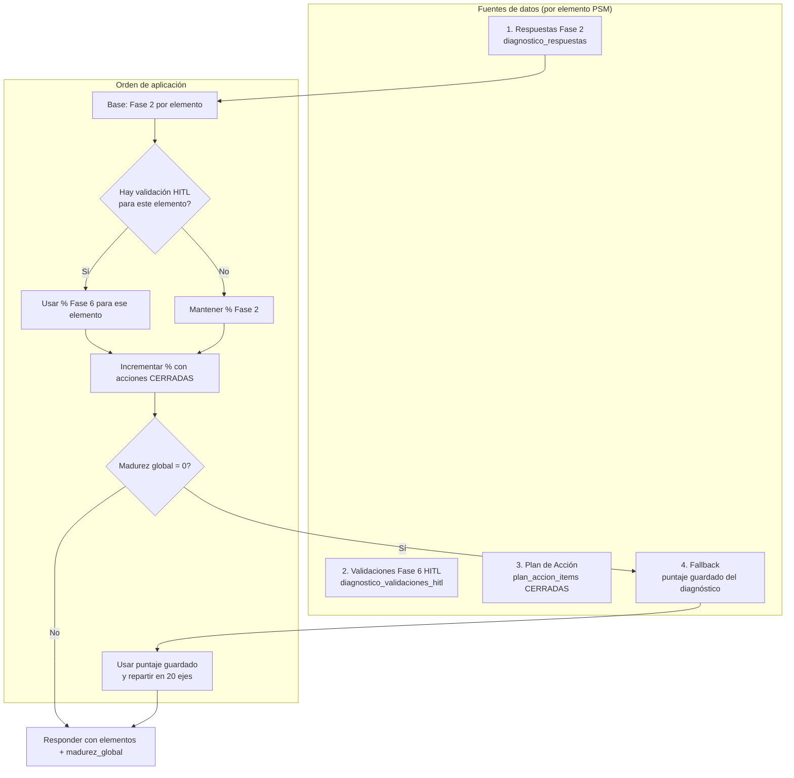
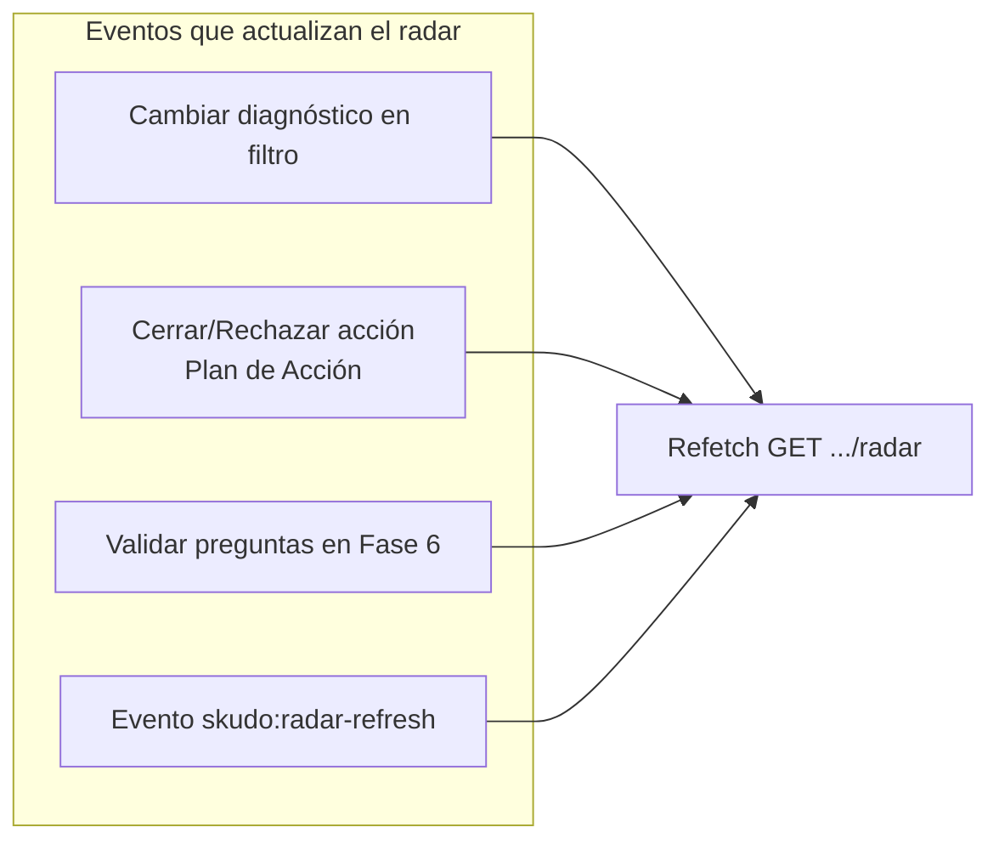
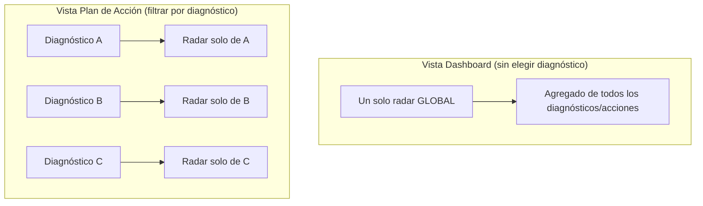
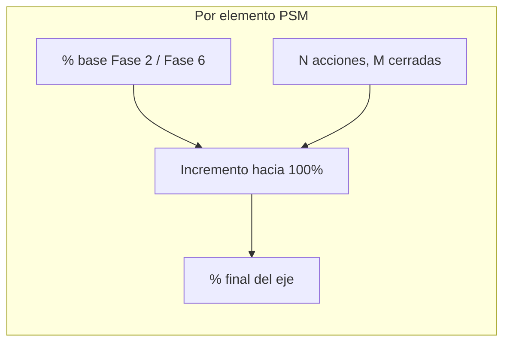

# Radar de Madurez PSM — Documentación

Este documento describe la lógica completa del Radar de Madurez: fuentes de datos, cuándo cambia, y el efecto de múltiples diagnósticos y del Plan de Acción.

---

## 1. ¿Qué es el radar?

El **Radar de Madurez PSM** es una gráfica de araña con **20 ejes** (los 20 elementos PSM/CCPS). Cada eje tiene un **puntaje de 0% a 100%**. Además se calcula un **puntaje global** (madurez global) y un **nivel** (Inicial, En Desarrollo, Definido, Gestionado, Optimizado).

```
                    Cultura
                       *
                    /  |  \
              Integridad  Auditorías
                  *   \  |  /   *
                       \|/
              ----------+----------
                       /|\
                  *   /  |  \   *
              Riesgos  ...  Emergencias
                       *
```

---

## 2. Dos modos del radar

| Modo | Endpoint | Dónde se usa | Qué muestra |
|------|----------|--------------|-------------|
| **Por diagnóstico** | `GET /api/diagnosticos/:id/radar` | Plan de Acción (al filtrar por un diagnóstico) | Solo ese diagnóstico: sus preguntas, validaciones y acciones |
| **Global (dashboard)** | `GET /api/dashboard/madurez` | Pantalla principal (Dashboard) | Agregado de todos los diagnósticos/acciones del tenant (o por planta) |

---

## 3. Flujo de cálculo del radar por diagnóstico

Cuando se pide el radar de **un diagnóstico** (`/api/diagnosticos/:id/radar`), el backend sigue este flujo:



### Tabla de fuentes (radar por diagnóstico)

| Orden | Fuente | Descripción | Cuándo se usa |
|-------|--------|-------------|----------------|
| **1** | **Respuestas Fase 2** | Cuestionario: Suficiente=3, Escasa=2, Al menos una=1, No evidencia=0. Por elemento: `(puntos / (total×3))×100`. | Siempre que exista snapshot en `diagnostico_preguntas` y respuestas en `diagnostico_respuestas`. Es la base que coincide con el % del diagnóstico (ej. 21%). |
| **2** | **Validaciones HITL (Fase 6)** | Misma regla de puntos por calificación humana/IA. | **Solo** si ese elemento tiene al menos una fila en `diagnostico_validaciones_hitl`. Si no hay validaciones, se mantiene el % de Fase 2. |
| **3** | **Plan de Acción** | Acciones con `estado_aprobacion = 'CERRADA'` suben el % del elemento (hasta 100%). | Siempre que existan ítems en `plan_accion_items` para ese diagnóstico y elemento. Solo cuentan las cerradas. |
| **4** | **Fallback** | Valor de `analisis_final_ia.puntaje_global` o `puntuacion` del diagnóstico. | Solo si tras 1–3 la madurez global sale 0%; se usa ese % como global y se reparte en los 20 ejes. |

---

## 4. ¿Cuándo cambia el radar?



| Evento | Efecto |
|--------|--------|
| **Cambiar el diagnóstico** en el filtro (Plan de Acción) | Se vuelve a llamar al API con el nuevo `id`; el radar muestra ese diagnóstico. |
| **Cerrar o rechazar una acción** del Plan de Acción | El backend recalcula el % del elemento; el front dispara `skudo:radar-refresh` y el radar vuelve a cargar. |
| **Validar preguntas en Fase 6** | La próxima vez que se pida el radar de ese diagnóstico, los elementos con validación usan el % de la Fase 6. |
| **Disparar `skudo:radar-refresh`** | El componente que muestra el radar hace refetch (dashboard global o radar por diagnóstico). |

---

## 5. Varios diagnósticos



- **Dashboard:** un único radar global; no es “el radar del diagnóstico A” sino una agregación.
- **Plan de Acción (o cualquier vista con selector de diagnóstico):** un radar por diagnóstico; al cambiar el filtro, el radar corresponde al diagnóstico seleccionado.

---

## 6. Efecto de las acciones del Plan de Acción

Solo suman al radar las acciones con **estado de aprobación = CERRADA** (flujo Maker-Checker).



- El % base (Fase 2 o Fase 6) **no se borra**; se **complementa** con el avance de acciones cerradas.
- Ejemplo: elemento al 40%, 2 acciones, 1 cerrada → el % sube; al cerrar la segunda, puede acercarse a 100%.

---

## 7. Resumen en una frase

**Base = respuestas del cuestionario (Fase 2)**; encima se aplican las **validaciones de la Fase 6 (HITL)** solo donde existan; luego las **acciones del plan cerradas** suben el % por elemento; y si todo diera 0%, se usa el **puntaje guardado del diagnóstico** para no mostrar 0%.

---

## 8. Referencia de código

| Parte | Ubicación |
|-------|-----------|
| API radar por diagnóstico | `server.js` — `GET /api/diagnosticos/:id/radar` |
| API radar global | `server.js` — `GET /api/dashboard/madurez` |
| Componente React | `src/components/RadarMadurez.jsx` |
| Uso con diagnóstico | `src/components/PlanDeAccion.jsx` (filtro por diagnóstico) |
| Evento de refresco | `window.dispatchEvent(new CustomEvent('skudo:radar-refresh'))` |
